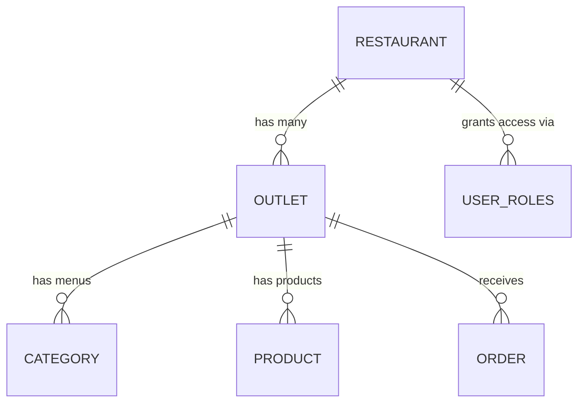
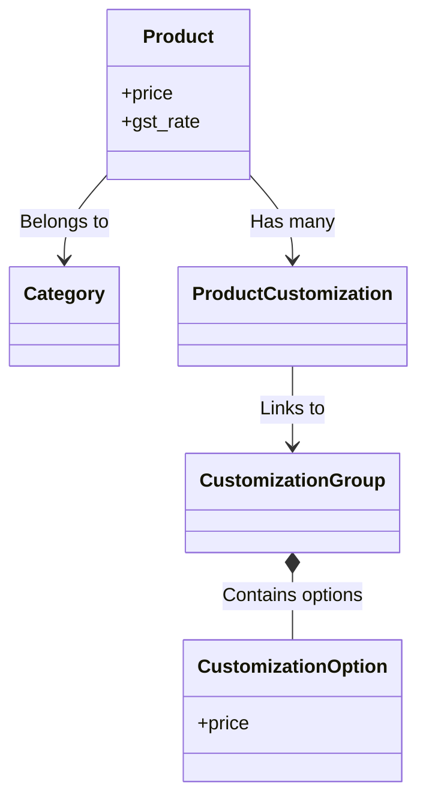
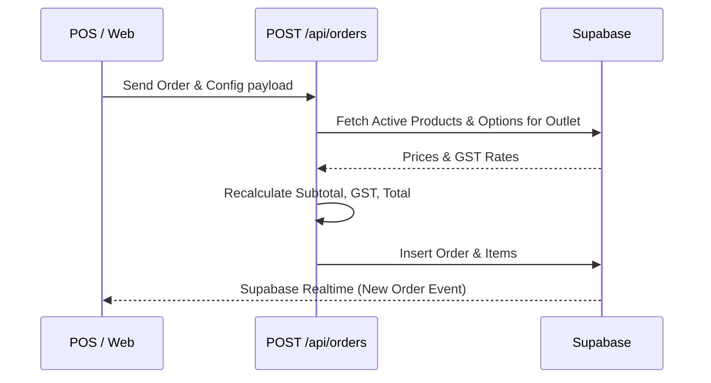

# Workflows Documentation

This document maps out the core workflows, data models, and multi-step processes in the application.

## 1. Multi-Tenant Architecture

**Goal:** Allow multiple restaurant brands to manage their own outlets and menus on a single platform.

**Structure:**
- **Restaurants:** The top-level tenant (e.g., "Starbucks India").
- **Outlets:** Physical store locations belonging to a Restaurant (e.g., "MG Road", "Koramangala"). Menus, Orders, and Pricing are strictly scoped to the `outlet_id`.
- **User Roles:** Users can have different permissions (`admin`, `manager`, `user/cashier`) per `restaurant_id` via the `user_roles` table.

---

## 2. Authentication & Authorization Workflow

**Goal:** Secure the application and isolate tenant data using Supabase Row Level Security (RLS).

**Steps:**
1. **Sign In:** User authenticates via Supabase Auth (Email/Password or OAuth).
2. **Session Cookie:** Next.js Server Components read the session cookie to identify the user.
3. **Role Check (RLS):** When the server queries the database, Supabase checks the `user_roles` table. A user can only `SELECT`, `UPDATE`, or `DELETE` rows if they have a matching `user_id` and `restaurant_id` in the `user_roles` table.
4. **Middleware Protection:** The Next.js `middleware.ts` intercepts routes like `/r/[slug]/admin/*` and ensures the user is logged in before even rendering the page.

---

## 3. Custom Domain Routing

**Goal:** Allow tenants to map their own domains (e.g., `order.cafemocha.com`) to their storefront instead of using the default path (`billjot.app/r/cafemocha`).

**Steps:**
1. **DNS Setup:** The tenant points their CNAME record to the application server.
2. **Middleware Interception:** The Next.js `middleware.ts` runs on every incoming request. It reads the `Host` header.
3. **RPC Lookup:** If the host is not the root domain (e.g., not `billjot.app`), the middleware calls the `restaurant_slug_for_domain(host)` database function.
4. **Rewrite:** The middleware transparently rewrites the URL from `order.cafemocha.com/` to `/r/cafemocha/` internally, without changing the URL in the user's browser address bar.

---

## 4. Menu Management Workflow

**Goal:** Create a hierarchical menu with items and add-ons (customizations).

**Steps:**
1. **Category Creation:** `Categories` are created per outlet (e.g., "Coffee", "Pizza").
2. **Customization Groups:** Create groups for modifiers (e.g., "Pizza Size", "Extra Toppings") defining whether they are `single` (radio buttons) or `multi` (checkboxes) select.
3. **Customization Options:** Attach pricing to choices inside a group (e.g., "Large: +₹40").
4. **Product Creation:** Products are created and mapped to `product_customizations` (linking a Product to a Customization Group).

**Diagram:**

---

## 5. POS Tab Management Workflow

**Goal:** Allow cashiers/waiters to keep a running bill (tab) open for a dine-in table before taking payment.

**Steps:**
1. **Open Tab:** Cashier selects "New Tab" in the POS and assigns a name (e.g., "Table 12"). Server Action `openTab()` fires.
2. **Add Items:** Throughout the meal, the cashier selects items and adds them to the tab via `addItemToTab()`. This saves the items to a temporary draft state (or a `pending` status order).
3. **KOT Generation:** Every time items are added, a Kitchen Order Ticket (KOT) is generated and sent to the `kitchen_stations` so the chefs start cooking.
4. **Close Tab (Checkout):** When the customer is ready to pay, `closeTab()` is called. The tab converts into a finalized `POST /api/orders` payload, recalculating final GST and totals, and the payment flow begins.

---

## 6. Order Processing Workflow

**Goal:** Handle the lifecycle of an order from placement to completion securely.

**Steps:**
1. **Order Placed:** Customer submits the checkout form via POS, Kiosk, or Web to `POST /api/orders` (or via closing a POS Tab).
2. **Price Re-computation:** 
   - If it is a First-Party order, the server discards client totals. It recalculates the final price using the server's database (`Products` + `CustomizationOptions` pricing) and extracts GST.
   - If it is a Third-Party order (Aggregator webhook), the server trusts the total (since aggregators markup prices) but extracts GST dynamically.
3. **Database Insertion:** Records inserted into `orders` and `order_items`.
4. **Real-time Sync:** Supabase Realtime broadcasts the new `pending` order to the POS dashboard.

**Diagram:**

---

## 7. Receipt Printing Workflow

**Goal:** Provide physical ESC/POS receipts for kitchen staff and customers.

**Steps:**
1. **Trigger:** POS user clicks "Print Receipt" on an order.
2. **Fetch:** POS fetches the binary payload from `GET /api/print/[orderId]`.
3. **Generation:** Server reads order details, formats an ESC/POS byte array (setting alignment, fonts, cuts), and returns it as `application/octet-stream`.
4. **Delivery:** The local client (via Web USB/Bluetooth or a local background daemon) pushes the bytes directly to the thermal printer hardware.
